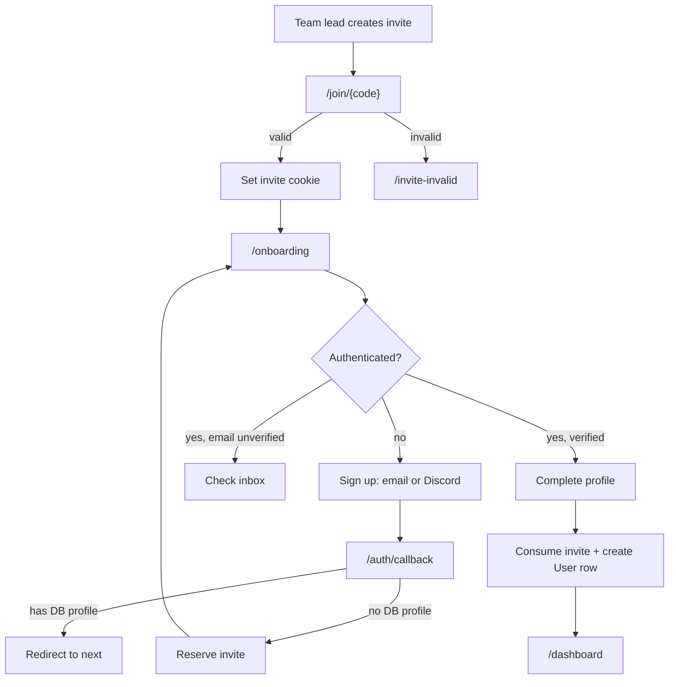

# Invite link & auth flow

Sign-up is **invite-only**. A user must arrive with a valid team invite before they can create an account. Existing users sign in normally; new users without a profile are routed through onboarding and must still hold a valid invite.

## Overview



## Data model

`Invite` rows live in Postgres (`packages/database/prisma/schema.prisma`):

| Field | Role |
|---|---|
| `id` | Opaque UUID used as the invite code in `/join/{id}` URLs |
| `teamId` | Team the new member joins |
| `maxUses` / `usesCount` | How many sign-ups the link allows |
| `expiresAt` | Hard expiry |
| `reservedByUserId` / `reservedAt` | Short-lived lock while someone finishes signup |

A Supabase auth user and an app `User` profile are separate. **Onboarding is complete** only after a `User` row exists in the database with `teamId` set from the invite.

## Invite creation

Team leaders and platform admins may create invites (`canCreateInvites` in `lib/auth/auth-guards.ts`).

- **UI:** `app/(dashboard)/invite/` via `createInviteLink` server action
- **API:** `POST /api/auth/create-invite`

Both paths validate permissions, team existence, `maxUses >= 1`, and a future `expiresAt`, then insert an invite with `id: randomUUID()` and return:

```
{siteUrl}/join/{invite.id}
```

## Entry: `/join/[code]`

`app/join/[code]/route.ts`

1. Rate-limited per client IP (60 requests / 15 min).
2. Looks up the invite by `id === code`.
3. Evaluates usability via `getInviteJoinFailureReason`:
   - `not_found` — no matching row
   - `exhausted` — `usesCount >= maxUses`
   - `expired` — past `expiresAt`
   - `reserved` — another user holds an active reservation
4. On failure → redirect to `/invite-invalid?reason=…` and clear any stale invite cookie.
5. On success → redirect to `/onboarding` and set the **invite cookie**:
   - Name: `stlvex_invite_code` (`INVITE_COOKIE`)
   - `httpOnly`, `sameSite: lax`, `path: /`
   - `maxAge`: min(7 days, time until invite expiry)

The cookie is the primary carrier of invite context for unauthenticated visitors. It is cleared after successful onboarding or on invalid-invite redirects.

## Invite resolution

`lib/auth/invite.ts` centralizes invite logic.

**For authenticated users**, `resolveInviteForAuthUser` checks sources in order:

1. `user.user_metadata.invite_code` (set during email or Discord signup)
2. `stlvex_invite_code` cookie

Metadata wins when present; the cookie is refreshed if it disagrees with metadata.

**Usability** (`isInviteUsable` / `assertInviteUsable`) requires:

- Not expired
- Uses remaining
- If reserved, only the reserving auth user (`reservedByUserId`) may proceed

Expired reservations (> 48 h, `RESERVATION_TTL_MS`) are treated as cleared automatically.

## Onboarding: `/onboarding`

`app/onboarding/page.tsx`

Guards on load:

| State | Behavior |
|---|---|
| Auth user + DB profile exists | Redirect `/dashboard` |
| Auth user + no profile + invalid invite | Sign out → `/invite-invalid` |
| No auth + no valid cookie invite | Clear cookie → `/invite-invalid` |
| Valid invite + missing team | `/invite-invalid?reason=not_found` |

Renders `OnboardingClient` in one of three modes:

| `step` | When | UI |
|---|---|---|
| `verify` | Not signed in | Email/password or Discord signup (`SignupForm`) |
| (email pending) | Signed in, email unverified | “Check your inbox” prompt |
| `profile` | Signed in, verified | First/last name form → `completeOnboarding` |

`/signup` is not a standalone entry point: it immediately redirects to `/onboarding` if a valid invite cookie exists, otherwise to `/invite-invalid`.

## Sign-up paths

### Email + password

`signUpWithCredentials` in `app/(auth)/actions/auth.ts`

1. `revalidateSignupInvite()` — requires valid invite cookie.
2. `supabase.auth.signUp` with `options.data.invite_code = invite.id`.
3. `emailRedirectTo`: `/auth/callback?next=/onboarding`.
4. If Supabase returns an immediate session → `/onboarding`.
5. Otherwise → `/onboarding?message=Check your email…` (user must confirm email before profile step).

### Discord

`signUpWithDiscord`

1. Same invite cookie validation.
2. OAuth redirect to `/auth/callback?next=/onboarding` with `invite_code` in OAuth data.
3. Callback reserves the invite and lands on onboarding (see below).

## Sign-in paths (existing vs in-progress users)

### Email login

`signInWithCredentials`

- Verifies email credential identity.
- If **no DB profile** (`shouldOnboard`) → requires valid invite cookie; otherwise signs out with `INVITE_REQUIRED_MESSAGE`.
- If profile exists → redirect to `redirectTo` (default `/dashboard`).

### Discord login

`signInWithDiscord` (from `/login`)

- No invite required upfront (`flow=login` on callback URL).
- At callback: users **without** a DB profile and **without** a resolvable invite are signed out with `DISCORD_LOGIN_REQUIRES_ACCOUNT_MESSAGE`.
- Discord login is for **existing linked accounts only**; new users must use an invite link first.

## OAuth callback: `/auth/callback`

`app/auth/callback/route.ts`

Shared handler for email confirmation links and Discord OAuth.

1. Exchange `code` for a Supabase session (or read existing session).
2. Verify session identity (`verifySessionIdentity`).
3. Look up DB profile (`lookupUserProfile`).

**Profile missing (new user):**

1. `resolveInviteForAuthUser` — metadata or cookie.
2. No invite → sign out → `/invite-invalid` (or `/login?error=…` for `flow=login`).
3. `reserveInviteForUser` in a transaction (prevents concurrent use).
4. Redirect `/onboarding?next=…`; refresh cookie if metadata and cookie disagreed.

**Profile exists:**

- Redirect to `next` (same-origin only, via `resolveSameOriginRedirect`).

`flow=link` is a separate path for linking Discord to an existing account (settings), not part of invite onboarding.

## Completing onboarding

`completeOnboarding` in `app/onboarding/actions.ts`

1. Requires authenticated Supabase user.
2. Email users must have `email_confirmed_at`; Discord users skip email verification.
3. Resolves invite again from metadata/cookie.
4. In a transaction:
   - Skip if `User` row already exists (idempotent).
   - `consumeInvite` — increment `usesCount`, clear reservation.
   - Create `User` with `teamId` from invite; link Discord account if applicable.
5. `confirmProfileVerification`, clear invite cookie, redirect `/dashboard`.

Invite errors (`InviteNotFoundError`, `InviteExhaustedError`, etc.) surface as form errors. Discord ID conflicts (`P2002`) return a dedicated message.

## Protected routes

`DashboardAuthenticatedShell` (`components/layout/DashboardAuthenticatedShell.tsx`) gates all dashboard layouts:

| `getCurrentUserState` | Redirect |
|---|---|
| `unauthenticated` | `/login` |
| `needs_verification` | `/login?error=…` |
| `needs_onboarding` | `/onboarding` |
| `ready` | Render dashboard |

`PROTECTED_ROUTE_PREFIXES` in `lib/auth/routes.ts` lists dashboard paths; enforcement happens at the layout shell, not middleware.

## Failure page: `/invite-invalid`

`app/invite-invalid/page.tsx`

Shows copy for `reason` query param (`not_found`, `expired`, `exhausted`, `reserved`). Clears the invite cookie on load. Offers a link to `/login` for users who already created an auth account but lost their invite link.

## Reservation lifecycle

Reservations prevent two people from completing signup on a single-use invite at the same time.

| Event | Effect |
|---|---|
| OAuth callback for new user | `reserveInviteForUser` sets `reservedByUserId` + `reservedAt` |
| `completeOnboarding` | `consumeInvite` increments uses, clears reservation |
| 48 h without completion | Reservation treated as expired; invite available again |
| Invalid invite redirect | Cookie cleared; session may be signed out |

## Key files

| Area | Path |
|---|---|
| Invite utilities | `lib/auth/invite.ts` |
| Auth server actions | `app/(auth)/actions/auth.ts` |
| Join route | `app/join/[code]/route.ts` |
| OAuth callback | `app/auth/callback/route.ts` |
| Onboarding page + action | `app/onboarding/page.tsx`, `app/onboarding/actions.ts` |
| Signup redirect guard | `app/(auth)/signup/page.tsx` |
| Invite creation | `app/(dashboard)/invite/actions.ts`, `app/api/auth/create-invite/route.ts` |
| Invalid invite UI | `app/invite-invalid/page.tsx` |
| Dashboard auth gate | `components/layout/DashboardAuthenticatedShell.tsx` |
| Tests | `tests/unit/auth/invite-*.test.ts`, `tests/integration/auth/invite-*.integration.test.ts` |
