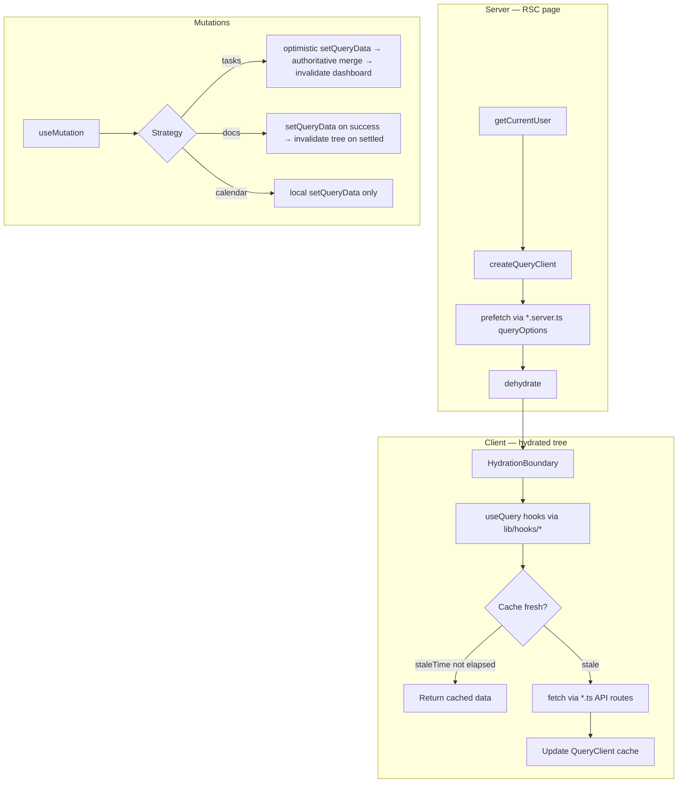

**IF YOU ARE AN AGENT, DO NOT MODIFY THIS FILE**

# Query caching strategy & flow

Client-side data for dashboard features is cached with **TanStack Query** (`@tanstack/react-query`). Server Components prefetch into a per-request `QueryClient`, dehydrate the cache, and hydrate it on the client so first paint avoids loading spinners. Mutations update the cache optimistically or via targeted `setQueryData`, with background invalidation when the shape of the data is hard to patch.

## Overview



## TanStack Query defaults

Configured in `lib/query-client.ts` and applied by `components/providers/QueryProvider.tsx` (root layout).

| Option | Value | Effect |
|---|---|---|
| `staleTime` | 5 minutes | Cached data is treated as fresh; no automatic refetch while navigating within the app |
| `gcTime` | 10 minutes | Unused query data is garbage-collected after 10 minutes off-screen |
| `refetchOnWindowFocus` | `false` | Tab focus does not trigger refetches |

Each server-rendered page creates its **own** `QueryClient` for prefetch/dehydrate. The long-lived client instance from `QueryProvider` receives that state via `HydrationBoundary` and owns cache updates from mutations.

## Query keys

All keys are defined in `queryKeys` (`lib/query-client.ts`). Hooks, prefetch helpers, and cache-updates must use these factories — never hand-rolled key arrays (except the intentional dashboard-tasks prefix match; see below).

| Domain | Key factory | Scoped by |
|---|---|---|
| Team tasks | `queryKeys.tasks.forTeam(teamId)` | team |
| Dashboard tasks widget | `queryKeys.dashboard.tasks(teamId, limit?)` | team + limit |
| Dashboard summary | `queryKeys.dashboard.summary(teamId)` | team |
| Calendar events | `queryKeys.events.forTeam(teamId)` | team |
| Inventory | `queryKeys.inventory.forTeam(teamId)` | team |
| Team members | `queryKeys.teams.members(teamId)` | team |
| Knowledge nodes | `queryKeys.knowledge.nodes(teamId)` | team |
| Knowledge edges | `queryKeys.knowledge.edges(teamId)` | team |

**Dashboard tasks prefix:** cache-updates use `["dashboard", "tasks", teamId]` (no `limit` segment) so `setQueriesData` / `invalidateQueries` hit every limit variant at once.

## Three-layer query options

Query configuration is split so server prefetch and client refetch share keys but use different data sources.

```
lib/queries/shared/<domain>.ts   → create*QueryOptions(teamId, queryFn)  — key + shape only
lib/queries/<domain>.ts          → client queryFn: fetch("/api/...")      — browser refetch
lib/queries/<domain>.server.ts   → server queryFn: Prisma / lib/data/*    — RSC prefetch
```

Example (tasks):

- `shared/tasks.ts` — `createTeamTasksQueryOptions`
- `tasks.ts` — `teamTasksQueryOptions` → `fetchTeamTasksFromApi`
- `tasks.server.ts` — `teamTasksQueryOptions` → `getTeamTasks` (direct DB)

Client hooks import from the **client** module; prefetch helpers import from the **server** module. Same `queryKey`, different `queryFn` — hydration merges cleanly.

## Server prefetch flow

Every prefetch-enabled dashboard page follows the same pattern:

1. `getCurrentUser()` for `teamId`
2. `createQueryClient()`
3. `await prefetch*(queryClient, teamId)` — parallel where useful
4. Wrap the view in `<HydrationBoundary state={dehydrate(queryClient)}>`

| Page | Prefetch helper | Queries warmed |
|---|---|---|
| `/dashboard` | `prefetchDashboard` | events, dashboard tasks, inventory, summary, day plans |
| `/task-list` | `prefetchTeamTasks` + `prefetchTeamMembers` | full task list, assignees |
| `/knowledge` | client fetch via `useTeamKnowledge` | nodes + edges |
| `/inventory` | `prefetchTeamInventory` | team inventory |
| `/calendar` | `prefetchTeamEvents` | calendar events |

Prefetch modules live in `lib/queries/prefetch-*.ts` and call `queryClient.prefetchQuery` with `*.server.ts` query options.

## Client read flow

Thin hooks in `lib/hooks/` wrap `useQuery`:

```ts
const team = useTeam();
return useQuery({
  ...teamTasksQueryOptions(teamId ?? ""),
  enabled: !!teamId,
});
```

`enabled: !!teamId` prevents fetches before `UserProvider` resolves the team. After hydration, if data is still within `staleTime`, `useQuery` returns the prefetched result with no network call.

Subsequent navigations reuse the root `QueryClient` cache until data goes stale or is invalidated/mutated.

## Cache update strategies

Helpers in `lib/queries/cache-updates/` keep mutation logic out of components. Pure merge functions (`mergeTaskInList`, etc.) are unit-tested in `tests/unit/queries/cache-updates.test.ts`.

### Tasks — optimistic + authoritative merge

`lib/hooks/use-team-task-mutations.ts` + `cache-updates/tasks.ts`

| Phase | Create | Update |
|---|---|---|
| `onMutate` | — | Cancel in-flight task queries; `optimisticallyPatchTeamTask` on team list + dashboard widget |
| `onSuccess` | `prependTeamTask` on team list | `applyTeamTaskPatch` — merge API response into team list and dashboard caches |
| `onError` | — | Roll back team list from snapshot |
| `onSettled` | `invalidateTaskDashboard` (summary + all dashboard task limits) | Same invalidation **only when `status` changed** |

Dashboard widget rules (`patchDashboardTasksList`):

- Status → `Done` removes the task from the widget list
- Otherwise title/status are patched in place

### Knowledge — invalidate on mutate

`lib/hooks/use-team-knowledge.ts` + `invalidateKnowledgeGraph`

Node/edge create/delete invalidate `knowledge.nodes` and `knowledge.edges` for the team.

### Calendar — local cache only

`CalendarView` appends events with `queryClient.setQueryData` on `queryKeys.events.forTeam`. There is no API persistence yet; events are client-side until a backend exists.

### Read-only domains

Inventory, team members, and prefetched events (outside calendar's local add) have **no mutation cache helpers** today — they rely on prefetch + default stale behaviour.

## Invalidation helpers

`lib/queries/cache-updates/invalidate.ts`

| Function | Invalidates |
|---|---|
| `invalidateTaskDashboard(teamId)` | `dashboard.summary`, all `dashboard.tasks` for team |
| `invalidateKnowledgeGraph(teamId)` | `knowledge.nodes`, `knowledge.edges` |

Invalidations are fire-and-forget (`void queryClient.invalidateQueries(...)`). Stale queries refetch in the background without blocking the mutation callback.

## Adjacent caches (not TanStack Query)

These sit alongside the query layer and are worth knowing when reasoning about “cached” data end-to-end.

### Server request deduplication

- `getCurrentUserState` — React `cache()` so layout + page share one auth/Prisma pass per request (`lib/auth/current-user.ts`)
- `verifySessionIdentity` — React `cache()` plus an in-memory TTL map (30 s default, 5 min when verified) to skip repeat identity checks (`lib/auth/identity.ts`)

### Inventory image URLs

`lib/hooks/use-inventory-image-url.ts` keeps a module-level `Map` of storage paths → signed URLs, with per-tick batching via `resolveInventoryImageUrls`. Independent of TanStack Query; inventory **rows** are cached by React Query, image **URLs** by this map.

## Adding a new cached query

1. Add a `queryKeys.*` entry in `lib/query-client.ts`
2. Add `create*QueryOptions` in `lib/queries/shared/`
3. Wire client `queryFn` (`lib/queries/<domain>.ts`) and server `queryFn` (`lib/queries/<domain>.server.ts`)
4. Add `lib/hooks/use-*` for reads
5. Add `lib/queries/prefetch-*.ts` and call it from the RSC page inside `HydrationBoundary`
6. For writes: prefer `setQueryData` when the merge is simple and testable; use `invalidateQueries` for structural changes; put logic in `lib/queries/cache-updates/`

## Key files

| Area | Path |
|---|---|
| QueryClient + keys | `lib/query-client.ts` |
| Provider | `components/providers/QueryProvider.tsx` |
| Shared queryOptions factories | `lib/queries/shared/` |
| Client fetch + queryOptions | `lib/queries/*.ts` |
| Server prefetch queryOptions | `lib/queries/*.server.ts` |
| Prefetch orchestration | `lib/queries/prefetch-*.ts`, `lib/queries/prefetch-dashboard.ts` |
| Cache mutations | `lib/queries/cache-updates/` |
| Read hooks | `lib/hooks/use-*.ts` |
| Task mutation hook | `lib/hooks/use-team-task-mutations.ts` |
| Knowledge mutation hooks | `lib/hooks/use-team-knowledge.ts` |
| Cache merge tests | `tests/unit/queries/cache-updates.test.ts` |
